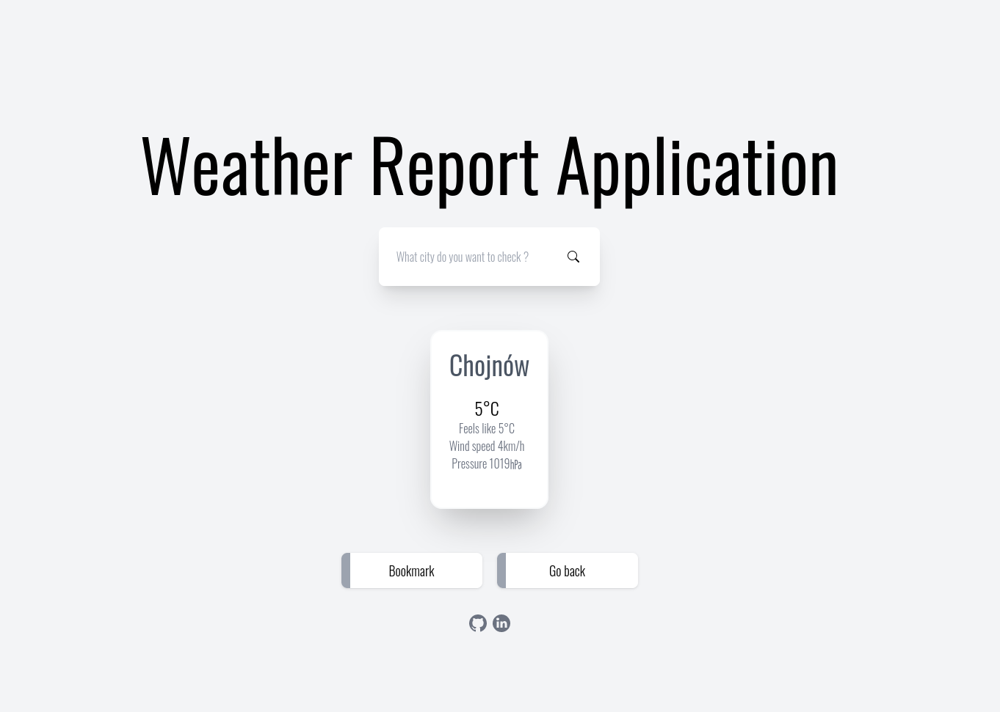

## Weather application
Application allows its users to quickly check fo the weather in their city of choice. There is also option to add most visited places to the bookmarks. 

This application is using Wttr.in to get the data.

### Application Preview

### Installation

Clone the repository:

```
git clone https://github.com/KarolZygadlo/WeatherApp
```

Then just follow the steps below:

* initialize `.env` file and customize to your needs:

```
cp .env.example .env
```

* open `phpunit.xml` and change 'APP_KEY'

* build and run containers:

```
make build
make run
```

* enter PHP shell and install composer packages and generate app key:

```
make php
    composer install
    php artisan key:generate
    exit
```

* enter Node shell and install npm packages and and run dev:

```
make node
    npm install
    npm run dev
    exit
```

### Launch the application
* open application in the browser via url:

```
localhost:80
```
### Running tests

You can run PHPUnit test cases

```
make test
```

### Code style check

You can run PHP-CS-Fixer:

```
make fix
```

### xDebug

To use xDebug you need to set `DOCKER_INSTALL_XDEBUG` flag to `true` in your local `.env` file. Then you need to rebuild
PHP container: `docker-compose up --build -d php`. You can also set
up [xDebug parameters](https://xdebug.org/docs/all_settings) in `docker/dev/php/php.ini` file.

### Available containers

* web - nginx HTTP server
* php - php and composer stuff
* node - npm stuff
